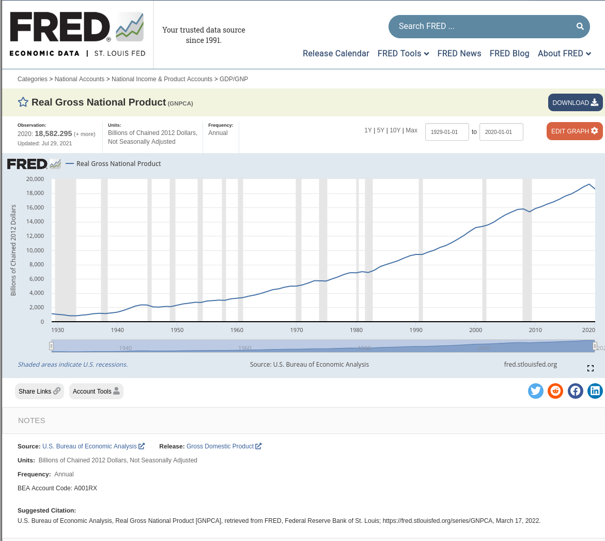

# Short discussion of use of API for reproducibility

Application programming interfaces (APIs) are popular, and often a very convenient way to get just the data one needs.

However, they pose reproducibility challenges:

- the data might change, in ways unknown to the researcher
- the API might change, breaking the researcher's code

This brief tutorial will discuss some safeguards that can be done at relatively low cost by the researcher to improve reproducibility.

# The setting

We will use the St. Louis Fed's FRED data service, frequently used by economists. In this example, we will use a single time-series -- `GNPCA` -- but the example can be easily extended to a whole set of series. 

Most researchers will use the default landing page for a time-series, in this case, [https://fred.stlouisfed.org/series/GNPCA](https://fred.stlouisfed.org/series/GNPCA). 



They might be using Stata, and import the data using the `import fred`  command (see [manual](https://www.stata.com/manuals/dimportfred.pdf)) as follows:

```{stata}
import fred GNPCA
li if datestr == "2020-01-01"
```

which yields

```
. import fred GNPCA

Summary
-------------------------------------------------------------------------------
Series ID                    Nobs    Date range                Frequency
-------------------------------------------------------------------------------
GNPCA                        92      1929-01-01 to 2020-01-01  Annual
-------------------------------------------------------------------------------
# of series imported: 1
   highest frequency: Annual
    lowest frequency: Annual
. li if datestr == "2018-01-01"

     +-----------------------------------+
     | datestr          daten   GNPCA_~1 |
     |-----------------------------------|
 90. | 2018-01-01   01jan2018    18897.8 |
     +-----------------------------------+


```

Done? Not so fast.

# The failure to reproduce

For this example, I ran the commands on 2022-03-17. What happens when I run the above command a year later, on 2023-03-17? The likely output will be

```
/* Fictious output, created on 2022-03-17, for a hypothetical run on 2023-03-17 */
Summary
-------------------------------------------------------------------------------
Series ID                    Nobs    Date range                Frequency
-------------------------------------------------------------------------------
GNPCA                        93      1929-01-01 to 2021-01-01  Annual
-------------------------------------------------------------------------------
# of series imported: 1
   highest frequency: Annual
    lowest frequency: Annual
```

I would have one additional observation... but might other things change as well? As it turns out, yes. In fact, for this particular series, each data point changes (read the Bureau of Economic Analysis' explanation for why this happens). I cannot show that this for the future, but let's see how we can see that for the past.

# What did the data look like as of a particular date?

The FRED API actually allows to specify a "`vintage`" or "`realtime`" parameter. We will use `vintage`  here:

```
vintage(datespec) imports historical vintage data according to datespec. datespec may either be a
   list of daily dates or _all. When datespec is a list of dates, the specified series are imported as
   they were available on the dates in datespec. 
```

So though we queried the data as of 2022-03-17, what did the data pull look one year **in the past**? Let's check.

```
. import fred GNPCA, vintage(2021-03-17)

Summary
-------------------------------------------------------------------------------
Series ID                    Nobs    Date range                Frequency
-------------------------------------------------------------------------------
GNPCA_20210317               91      1929-01-01 to 2019-01-01  Annual
-------------------------------------------------------------------------------
# of series imported: 1
   highest frequency: Annual
    lowest frequency: Annual

. li if datestr == "2018-01-01"

     +-----------------------------------+
     | datestr          daten   GNPCA_~7 |
     |-----------------------------------|
 90. | 2018-01-01   01jan2018    18951.9 |
     +-----------------------------------+
```

So we have one less observation -- not very surprising -- but also, the one data point we pick out -- `GNPCA` as of "2018-01-01" -- is **different**. 

# The solution, part 1

This should make it clear to researchers that they need to lock in the data view. This is easy enough - we just did it in the above example. Define a date (possibly as of the date the researchers are writing the paper), and always query the API as of that date.

```{stata}
import fred GNPCA , vintage(2022-03-17)
```

# What if the API breaks

The FRED API is awesome. But it might become even more awesome. Or the API program might be ended, or the API might be moved to the San Francisco Fed, and re-implemented there. In short, the API might break or disappear. 

Researchers should therefore preserve a version of the data on the first pull from the API, and use it going forward. This has three advantages:

- it preserves the version of the data used locally
- it speeds up processing when re-executing the code (the call to the API takes 1-2 seconds, and over time, that might accumulate)
- it protects against breaks of the API

Without necessarily over-engineering for the third point, a simple way to implement this is to store a local file with the information pulled down, and check for its presence before accessing the API:

```{stata}
cap mkdir "data"
cap mkdir "data/fred"
capture confirm file "data/fred/fred_gnpca.dta"
if _rc == 0 {
    noi di in red "Re-using existing file"
    use  "data/fred/fred_gnpca.dta" , clear
}
else { 
    /* code if the file does not exist */
    /* you could do the full API pull  */
    /* conditional on the intermediate */
    /* file NOT being there.           */
    noi di "$NOTE Reading in data from FRED API with vintage=$VINTAGE"
    clear
    import fred GNPCA, $DATERANGE vintage($VINTAGE)
    save "data/fred/fred_gnpca.dta"
    use  "data/fred/fred_gnpca.dta" , clear
} 
```

The saved file (`data/fred/fred_gnpca.dta`) should be part of any replication package, and more generally, that should be the case for any such data, as long as the data license permits such redistribution.

# Full example

The complete example can be found in [`main.do`](main.do). Note that you need to define an API key. To do so,

- go to [https://fredaccount.stlouisfed.org/apikeys](https://fredaccount.stlouisfed.org/apikeys) (you need a St. Louis Fed account, which is free)
- create an API key, and copy it.
- copy `set_key_template.do` to `set_key.do` and replace the placeholder value in that code with your own API key.
- it will be read by the `main.do` file, allowing for API access.

# Other software

There exist similar interfaces to FRED in MATLAB, R ([`fredr`](https://www.rdocumentation.org/packages/fredr/versions/2.1.0)), and probably trivially in Python.


# Don't forget to cite the data


Suggested Citation:

> U.S. Bureau of Economic Analysis, Real Gross National Product [GNPCA], retrieved from FRED, Federal Reserve Bank of St. Louis; https://fred.stlouisfed.org/series/GNPCA, March 17, 2022.

# System information

All results were generated by the following system:

* "openSUSE Leap 15.3"
* AMD Ryzen 9 3900X 12-Core Processor, 24 cores , 31GB memory 
* Docker version 20.10.12-ce, build 459d0dfbbb51 
* stata version 17 (Docker image dataeditors/stata17:2022-01-17)

Command run:
```
git clone https://github.com/labordynamicsinstitute/alfred_example.git
cp $SAFE/set_key.do alfred_example
cd alfred_example/
docker run -it --rm -v $PATHLIC/stata.lic:/usr/local/stata/stata.lic -v $REPOPATH:/project -w /project dataeditors/stata17:2022-01-17 -b do main.do
```