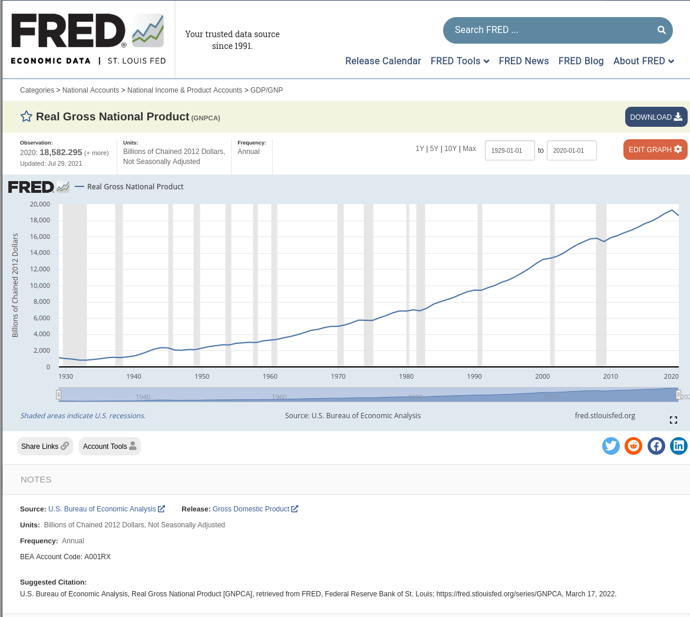

## Why this example matters

Application programming interfaces (APIs) are convenient, but they create reproducibility risks.

- Data can change without the researcher noticing.
- API behavior can change and break existing code.
- A lightweight workflow can reduce both risks.

## The setting

This example uses the St. Louis Fed's FRED service and the `GNPCA` time series.

- Series page: <https://fred.stlouisfed.org/series/GNPCA>
- The same pattern extends to larger collections of series.
- The repository's Stata example is in `main.do`.

## Typical workflow

Researchers might import the series directly from FRED:

```stata
import fred GNPCA
li if datestr == "2020-01-01"
```

This feels reproducible, but it is not enough on its own.

## What the user sees

```text
. import fred GNPCA

Summary
-------------------------------------------------------------------------------
Series ID                    Nobs    Date range                Frequency
-------------------------------------------------------------------------------
GNPCA                        92      1929-01-01 to 2020-01-01  Annual
-------------------------------------------------------------------------------
# of series imported: 1
   highest frequency: Annual
    lowest frequency: Annual
. li if datestr == "2018-01-01"

     +-----------------------------------+
     | datestr          daten   GNPCA_~1 |
     |-----------------------------------|
 90. | 2018-01-01   01jan2018    18897.8 |
     +-----------------------------------+
```

## FRED landing page

{fig-alt="FRED landing page for GNPCA"}

## The reproducibility problem

Running the same command later can change the dataset.

- A later pull can include more observations.
- Historical values can also be revised.
- Re-execution may no longer match the original analysis.

## A year later

```text
/* Fictitious output, created on 2022-03-17, for a hypothetical run on 2023-03-17 */
Summary
-------------------------------------------------------------------------------
Series ID                    Nobs    Date range                Frequency
-------------------------------------------------------------------------------
GNPCA                        93      1929-01-01 to 2021-01-01  Annual
-------------------------------------------------------------------------------
# of series imported: 1
   highest frequency: Annual
    lowest frequency: Annual
```

The pull now contains an additional observation.

## Historical values can change too

The FRED API supports a `vintage()` parameter for historical views of the data.

```text
vintage(datespec) imports historical vintage data according to datespec.
datespec may either be a list of daily dates or _all.
```

That lets researchers reconstruct what the series looked like on a specific date.

## Looking back in time

```text
. import fred GNPCA, vintage(2021-03-17)

Summary
-------------------------------------------------------------------------------
Series ID                    Nobs    Date range                Frequency
-------------------------------------------------------------------------------
GNPCA_20210317               91      1929-01-01 to 2019-01-01  Annual
-------------------------------------------------------------------------------
# of series imported: 1
   highest frequency: Annual
    lowest frequency: Annual

. li if datestr == "2018-01-01"

     +-----------------------------------+
     | datestr          daten   GNPCA_~7 |
     |-----------------------------------|
 90. | 2018-01-01   01jan2018    18951.9 |
     +-----------------------------------+
```

## Key finding

The 2018 value differs across pulls.

- Later data access is not the same as original data access.
- Historical revisions matter for reproducibility.
- Researchers need to lock in the data view they analyze.

## Solution, part 1: fix the vintage

Always query the API with a specific vintage date.

```stata
import fred GNPCA, vintage(2022-03-17)
```

A fixed vintage anchors the data to a reproducible view.

## Solution, part 2: cache the pulled data

Researchers should preserve the first API pull locally.

- It preserves the exact dataset used in analysis.
- It speeds up repeated runs.
- It protects against API changes or disappearance.

## Reuse a local copy when present

```stata
cap mkdir "data"
cap mkdir "data/fred"
capture confirm file "data/fred/fred_gnpca.dta"
if _rc == 0 {
    noi di in red "Re-using existing file"
    use  "data/fred/fred_gnpca.dta" , clear
}
else {
    noi di "$NOTE Reading in data from FRED API with vintage=$VINTAGE"
    clear
    import fred GNPCA, $DATERANGE vintage($VINTAGE)
    save "data/fred/fred_gnpca.dta"
    use  "data/fred/fred_gnpca.dta" , clear
}
```

## Replication-package implication

The saved file should ship with the replication package when licensing permits.

This gives future users access to the exact data used in the analysis even if the API no longer behaves the same way.

## Full example in this repository

The complete Stata example is in `main.do`.

To run it:

- Create a free FRED API key.
- Copy `set_key_template.do` to `set_key.do`.
- Replace the placeholder with your API key.
- Run `main.do` in Stata.

## Other software

Similar interfaces exist outside Stata as well.

- MATLAB
- R via `fredr`
- Python and other languages through the API

## Citation reminder

> U.S. Bureau of Economic Analysis, Real Gross National Product [GNPCA], retrieved from FRED, Federal Reserve Bank of St. Louis; https://fred.stlouisfed.org/series/GNPCA, March 17, 2022.

## System information

The README documents the original execution environment:

- openSUSE Leap 15.3
- AMD Ryzen 9 3900X, 31GB memory
- Docker 20.10.12-ce
- Stata 17 (`dataeditors/stata17:2022-01-17`)

## Takeaways

- APIs are convenient but can undermine reproducibility.
- FRED vintages help lock analysis to a point in time.
- Saving pulled data locally adds a second layer of protection.
- This repository provides a compact example of both safeguards.
